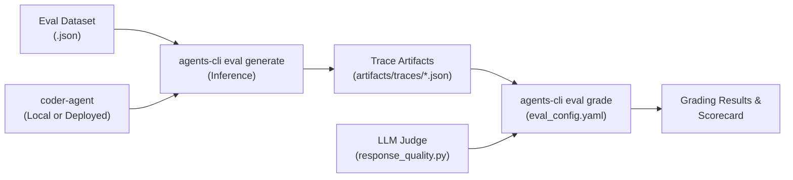

# ADK Evaluation Implementation Guide

This document describes the Agent Development Kit (ADK) evaluation architecture and implementation in `coder-agent`.

---

## Overview

The evaluation harness in `coder-agent` is built on top of `google-adk[eval]` and driven by `agents-cli eval`. It provides a structured workflow to generate interaction traces, grade agent outputs against automated metrics and LLM judges, and identify regressions before deployment.

---

## Key Files & Structure

```
coder-agent/
├── pyproject.toml                         # Declares google-adk[eval] dependency
└── tests/
    └── eval/
        ├── eval_config.yaml               # Metric selection and custom metric definitions
        ├── response_quality.py            # Local LLM-as-a-Judge implementation (Gemini Flash)
        └── datasets/
            ├── README.md                  # Dataset shapes, synthesis, and eval CLI guide
            └── basic-dataset.json         # Sample single-turn & multi-turn evaluation cases
```

### 1. Dependency Configuration
* **File:** [`coder-agent/pyproject.toml`](file:///home/ablythe/repos/workshop-agentic-sdlc-lab/coder-agent/pyproject.toml)
* Enables ADK evaluation support via `google-adk[eval]>=2.5.0,<3.0.0`.

### 2. Evaluation Suite Configuration
* **File:** [`coder-agent/tests/eval/eval_config.yaml`](file:///home/ablythe/repos/workshop-agentic-sdlc-lab/coder-agent/tests/eval/eval_config.yaml)
* Defines which metrics are active during grading:
  * `custom_response_quality`: Points to the local Python evaluator `response_quality.py`.
  * `agent_turn_count`: Inline Python metric evaluating the conversation turn count from `agent_data`.

### 3. Custom LLM-as-a-Judge Metric
* **File:** [`coder-agent/tests/eval/response_quality.py`](file:///home/ablythe/repos/workshop-agentic-sdlc-lab/coder-agent/tests/eval/response_quality.py)
* Uses the Google GenAI SDK (`google-genai`) with model `gemini-3.6-flash` (via Application Default Credentials or `GEMINI_API_KEY`).
* Implements structured grading output using Pydantic:
  ```python
  class _Verdict(BaseModel):
      score: int  # 1-5
      explanation: str
  ```
* Evaluates accuracy, relevance, and factual consistency against expected ground truth references.

### 4. Evaluation Datasets
* **File:** [`coder-agent/tests/eval/datasets/basic-dataset.json`](file:///home/ablythe/repos/workshop-agentic-sdlc-lab/coder-agent/tests/eval/datasets/basic-dataset.json)
  * Supports single-prompt prompts (Shape A) and continued-conversation turns with prior events (Shape B).
* **File:** [`coder-agent/tests/eval/datasets/README.md`](file:///home/ablythe/repos/workshop-agentic-sdlc-lab/coder-agent/tests/eval/datasets/README.md)
  * Detailed documentation on dataset formats, synthesizing test cases, and comparing evaluation runs.

---

## Evaluation Workflow

The ADK evaluation runs in a two-stage pipeline:



### 1. Trace Generation (Inference)
Dispatches eval cases against the agent (spins up a local server automatically or connects to `--url`):
```bash
cd coder-agent
agents-cli eval generate --dataset tests/eval/datasets/basic-dataset.json
```

### 2. Grading & Scoring
Evaluates the captured traces against configured metrics:
```bash
cd coder-agent
agents-cli eval grade --config tests/eval/eval_config.yaml
```

### 3. Comparing Runs & Analysis
```bash
# Compare candidate run against baseline
agents-cli eval compare baseline_results.json candidate_results.json

# Analyze and cluster failures
agents-cli eval analyze candidate_results.json
```
